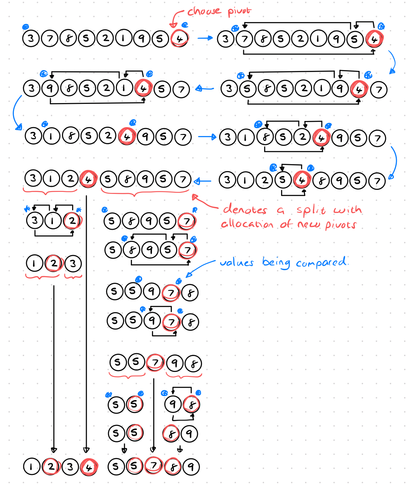
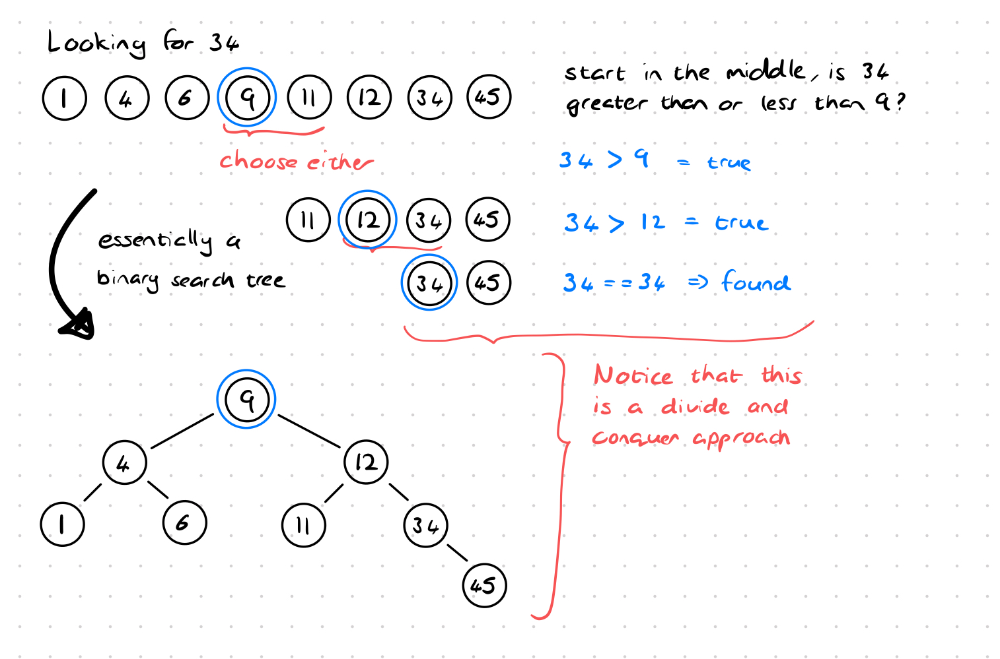
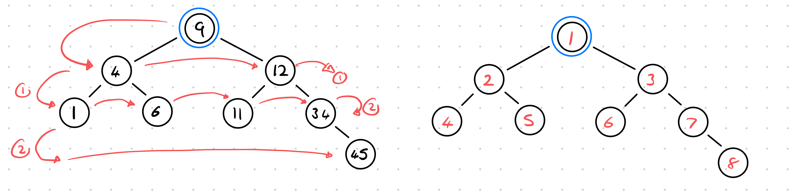
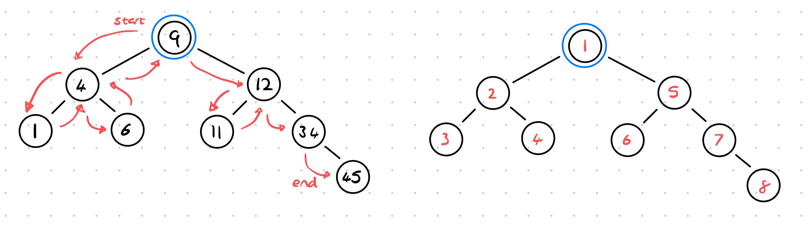

# Algorithms

## Recursion
Here is the quickest example

```bash
ls -R # where -R denotes recursive
```

The function lists all the files in a directory, if there are any directories
listed it will also go into those directories and list all the files, again
it will go into any directories and list all the files and so on...

A **recursive function** is a function that refers to itself inside the 
function.

```go
package recursive

func recursiveFunction() {
	// here the function refers to itself
	recursiveFunction() 
}
```

A recursive function needs to have what is called a *base case* or *stop point*, 
causing the cycle to end. Recursive functions have two paths, call the recursive
function and run again or call the base case to stop the function.

```javascript
let counter = 0;
function recursion() {
    if (counter > 3) {
        return 'done';
    }
    counter++;
    return recursion();
}
```

So to create a successful recursive function you need to following basic 
structure:

1. Identify the base case.
2. Identify the recursive case.
3. Get closer and closer, then return when needed. Usually you have two returns
for the base case and the recursive case.

```go
package main
import "math/rand"

func Traverse() string {
	// there must be a base case condition check
	someCondition := rand.Intn(1)
	if someCondition == 0 {
		// it must return something
        return "done"
	}
	// to allow the returned value to bubble up through the call stack, everytime
	// the recursive function is called, it's result should be returned.
	// Otherwise, it will end up returning void/undefined/nil
	return Traverse()
}
```

## Sorting

What's all the fuss with sorting, don't most languages have built-in sorting
functions? Sorting is not an issue for small datasets, when the datasets become
larger and larger, the sorting algorithm plays an important role, as well as the
amount of time the code needs to sort all the data it is working with as this
can greatly slow down a process.

### Bubble Sort

One of the elementary sorting algorithms.

**Bubble sort** given an array of items, it steps through the array and compares
each pair, each time if the second is larger than the first it will swap them
around. Now that the largest element is at the top, we perform the sort again
however with the array shortened by one, because the largest value is already at
the top.

### Selection Sort

One of the elementary sorting algorithms.

**Selection sort** works like sorting a hand of cards, we scan for the smallest
element, and put that in the first position, then we scan for the next smallest
element and put that next to the previous smallest.

### Insertion Sort

Is used when the array of elements is almost sorted.

**Insertion sort** starts with the first element, then with the compares the
first to the second element and places it before if it is smaller, then moves to
the next element and compares to all the previous elements and places where it 
needs to be.

### Merge Sort

Is an `O(n log n)` because they used a _divide-and-conquer_ approach to solve
a problem in conjunction with recursion, to break to problem into a smaller
subset, solve the problem and merge them back together.

_merge sort_ is also known as a **stable algorithm** which means that when two
of the same elements are compared, they maintain their position in the array.
If the first element is equal to the second element, they are kept in the order
first and second.

### Quick Sort

Is a _divide and conquer_ algorithm, as well as a pivoting technique.



It starts by choosing a pivot, and then sequentially comparing to all values
before it until it finds the final location. From there it divides the remaining
elements into an left and right section and repeats the process.

This implementation always chooses the pivot as the last element, however, the
pivot can be chosen as any element. What is important is that the pivot should
be compared to each element in the array until it has found its final position.
Only then is the array divided to the left and right, excluding the pivot which
is already in its final position.

### Heap Sort

...

### Radix and Counting Sort

...

## Searching and Traversal

### Linear Search

**Linear search** or **sequential search** is a method of finding a target value
with a list/array/slice. It sequentially checks each element of the list for the
target value until a match is found or until all the elements have been
searched.

Having a list that is completely random and looking for a specific element is
challenging, consider

```
[4, 1, 7, 12, 3, 9, 6, 14, 18, 5]
```

Then we would possibly need to search through the entire list to find an
element. However, if the list were sorted, would/could this improve the
searching capabilities? Consider

```
[1, 3, 4, 5, 6, 7, 9, 12, 14, 18]
```

The short answer is yes, because we can stop the moment we know we have gone
too far.

### Binary Search


... add image using divide and conquer

### Breadth First Search/Traversal



You start with the first node, then move left to right across the next level,
then move left to right across the next level and so forth for each level.

**Questions**:

1. If you know  a solution is not far from the root of the tree?
   1. Use breadth first search.
2. If the tree is very deep and the solutions are rare?
   1. Use breadth first search. This is if we suspect that solutions are near.
      (Since it will search all the way down in DFS)
3. If the tree is very wide?
   1. Depth first search, if solutions are further away. (BFS will need a lot 
      of memory).
4. If solutions are frequent but located deep in the tree?
   1. Depth first search.
5. Determining whether a path exists between two nodes?
   1. Depth first search.
6. Finding the shortest path?
   1. Breadth first search.


### Depth First Search/Traversal



For *depth first search* there are three variations:
1. InOrder.
2. PreOrder.
3. PostOrder

Suppose we have a graph
```
       9
   4       20
 1   6   15   170
```
An *InOrder* result would be `1 4 6 9 15 20 170`, first is the depth, down to 
`1` then one up to `4`, back down to `6` then up to `9`, then all the way down
to `15` back up to `20` then finally down to `170`.

An *PreOrder* result would be `9 4 1 6 20 15 170`, first start at the root, `9`,
then the first child `4`, then the next child `1`, no more children back up to 
the next child `6`, back up to the next child `20`, then `15` and finally `170`.
*PreOrder* is great for recreating a tree.

An *PostOrder* result would be `1 6 4 15 170 20 9`, first down to all the
children `1` then `6`, back up `4`, then all the way down `15` and `170` back up
one level `20` and finally the root `9`.

### Graphs vs Tree

Trees are simply a representation of a graph, and therefore the searching is the
same breadth depth first or depth first search.

## Dijkstra and Bellman-Ford Algorithms

For finding a shortest path, other algorithms include Dijkstra or Bellman-Ford
for finding the shortest path in special cases.

The normal breadth first search it assumes that each jump in a graph / each path 
has the same weight. The weight of an edge could be the cost to travel along
that edge to the next node. This is common in finding the shortest path not just
in the number of nodes, but if those edges represented the distance then the 
algorithm should choose differently according to the cost of each edge.

*Example* in Google Maps, a certain edge may be the shortest, or the least
traffic or the fastest path.

**Bellman-Ford** is good at solving the shortest path over Dijkstra because it
can accommodate negative weights. With time complexity of `O(n^2)`

**Dijkstra** is good at solving the shortest path is less complex than the 
Bellman-Ford algorithm.

Resources:
- 