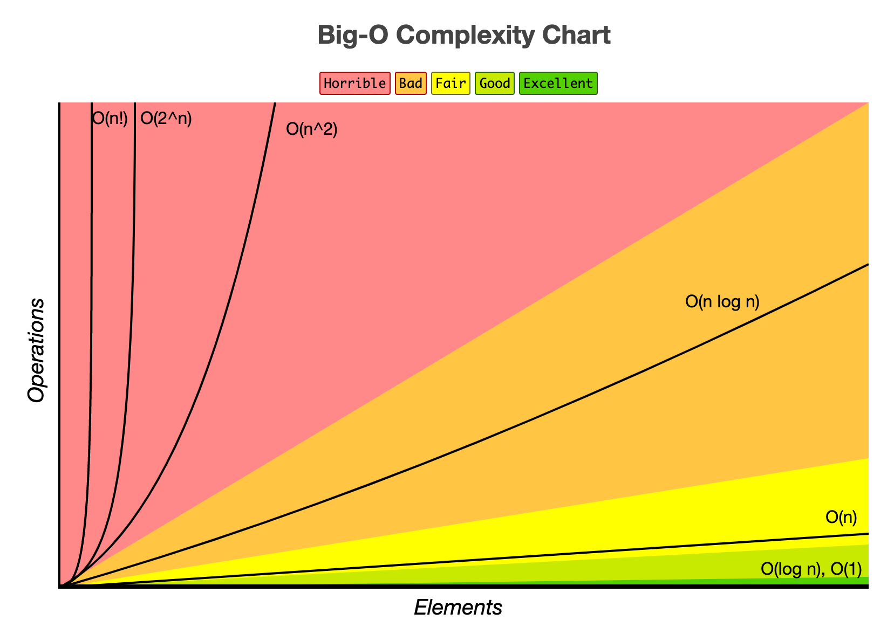

# Big O Notation

**What is good code?**
1. Readable
2. Scalable [Big O]



## Basic Notation

### O(1) Constant Time
Constant time is the time taken to perform a single operation, let `c` denote
then time taken by a machine to do a single operation.

Example
```go
package main
// Add takes two integers, adds them and returns the result.
func Add(a, b int) int {
	return a + b
}
```
The `add` function has a single operation, that is, `a + b`. Therefore, the
`add` function takes `c` amount of time to complete the function of a single
operation, and is considered to take `O(1)` or constant time.

### O(n) Linear Time
Linear time is the time taken to perform operations that scale as the number of
elements in the input scale. Let `c` denote the time taken to perform a single
operation.

Example
```go
package main

func Sum(ints []int) int {
	sum := 0
	for i := 0; i < len(ints); i++ {
		sum += ints[i]
    }
	return sum
}
```
The `print` function takes a constant time `c` to perform the `fmt.Printf`
operation. However, this occurs as many times as there are elements within the
slice of ints, `ints`. So as the input argument `ints` grows linearly, so the
time taken to complete the function will also grow linearly.

*Example*
```go
package main

func anotherFunc() {/* does something */}

func whatO(input []int) int {
	a := 10 // O(1)
	a = 50 + 3 // O(1)
	for i := 0; i < len(input); i++ { // O(n)
		anotherFunc() // O(n)
		a++ // O(n)
    }
	return a // O(1)
}

// From this we can calculate the BigO
// 1 + 1 + n + n + n + 1
// 3 + 3n
// => O(3 + 3n)
// => O(n)
```

### O(nm) or O(n^2) quadratic Time
Quadratic time is the time taken to perform operations that scale within a
nested loop.

```go
package main
import "fmt"
func logAllPairsOfArray(letters []string) {
	for i := 0; i < len(letters); i++ { // O(n)
		for j := 0; j < len(letters); j++ { // O(n)
			fmt.Println(letters[i], letters[j])
        }
    }
}
// O(n^2)

func logAllPairsOfArrays(letters []string, ints []int) {
	for i := 0; i < len(letters); i++ { // O(n)
		for j := 0; j < len(ints); j++ { // O(m)
			fmt.Println(letters[i], ints[j]) 
		}
	}
}
// O(nm)
```


## Big O Simplification
1. The worst case.
2. Remove constants.
3. Different terms for different inputs.
4. Drop non-dominants.

**The Worst Case**

When calculating the Big O, we always calculate for the worst case. This is 
because we want to know what is the longest possible time that the algorithm
can take.

**Remove Constants**

Suppose we have a function that has Big O of `O(2n + 100)`, asymptotically
as `n -> infinity` we have `O(10000100)` and `O(100000000100)` and we see that
the constant `100` has little effect on the computation time as `n` scale,
therefore, we only really care about what the scalable terms do, and we can drop
or simplify our Big O notation to simply `O(n)`.

**Different Terms for Different Inputs**

As with the example above `logAllPairsOfArrays(letters []string, ints []int)`
the inputs `letters` and `ints` have different sizes, therefore in Big O, we
will assign different values for the lengths which we interpret when scaling
to infinity. 

Suppose `letters` has length `n` and `ints` has length `m`. Then if they were
loops adjacent to one another we have `O(n + m) => O(n) linear time`. If they
were nested loops one within the other we have `O(n*m) => O(nm)`.

**Drop Non-dominants**

Suppose we have a function with an input `ints []int`, and with the function
we have a loop `O(n)`, after the loop we loop and find all pairs `O(n^2)` and
a few constant operations.

We have Big O of `O(n^2 + n + 100)`, as `n` scales `n^2` dominates all other
terms. The term with the largest power will always be the dominant term. So we
can simplify the Big O to `O(n^2 + n + 100) => O(n^2)`

---

## Cheat Sheet

**Big Os**

| Big O      | Time             | Description                                                                            |
|------------|------------------|----------------------------------------------------------------------------------------|
| O(1)       | Constant time    | no loops                                                                               |
| O(log n)   | Logarithmic time | usually searching algorithms have log(n) if they are sorted (Binary Search)            |
| O(n)       | Linear time      | for looping                                                                            |  
| O(n log n) | Log linear time  | usually sorting algorithms                                                             |
| O(n^2)     | Quadratic time   | nested loops, every element in a collection need to be compared to every other element |  
| O(2^n)     | Exponential time | recursive algorithms that solve a problem of size n                                    |
| O(n!)      | Factorial time   | you are adding a loop to every element                                                 |

**What can cause time in a function**

Operations (+, -, *, /)  
Comparisons (==, !=, >, <)  
Looping (for, while)  
Outside function calls  

**What causes Space Complexity**

Variables  
Data Structures  
Function Calls  
Allocations  

**Remember the Rules**

1. The worst case.
2. Remove constants.
3. Different terms for different inputs.
4. Drop non-dominants.

---