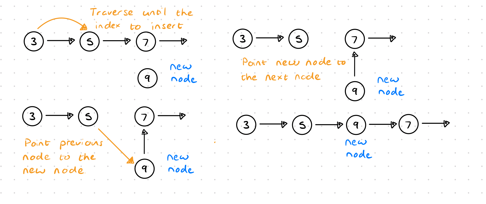

# Data Structures

## Introduction

**What is a data structure?** 

A *data structure* is a collection of values, the values can have relationships
between them and the values can have functions/methods applied to them.

- Each one is different in what it can do and what it is best used for.
- Each one is good and specialised for certain thing, there is not one data
structure that is the best at everything.

**How computers store data structures**

The computer uses three things to run programs:
- CPU - Time complexity.
- RAM - Space complexity.
- Storage - Long term storage.


A computer's CPU does the processing of information/data, however, it only 
understands bits and bytes. A **Bit** is a single `1` or `0`. A **Byte** is a 
collection of 8 Bits. `10010001` is an example of a byte. What does this mean, 
each position is `2^k` or two to the power of `k`, where `k` is the index of
the bits from left to right starting at 0. A `0` bit indicates the value is 
ignored a `1` denotes it is there. Then

```
00101001 = 0*(2^7) + 0*(2^6) + 1*(2^5) + 0*(2^4) + 1*(2^4) 0*(2^2) + 0*(2^1) + 1*(2^0)
         = 0*128 + 0*64 + 1*32 + 0*16 + 1*8 + 0*4 + 0*2 + 1*1
         = 0 + 0 + 32 + 0 + 8 + 0 + 0 + 1
         = 41
```
Then also we see that `00000000 = 0` and `11111111 = 256` as the minimum and
maximum, respectively that can be stored in a byte.

## Arrays

---

Arrays or Lists organise elements sequentially, that is one after the other
in memory.

```
 0      1      2       3     4       The index of each element
[Juice, Apple, Cheese, Kale, Mango]  The element
```

There are two types of arrays, the `static` array which has a fixed size and the
`dynamic` array, that can dynamically allocate additional size to the array. 

```go
package main
var staticArray [10]int
var dynamicArray []int // also known as a slice in Go
```

| Operation     | Big O |
|---------------|-------|
| Lookup        | O(1)  |
| Push/Pop      | O(1)  | 
| Insert/Append | O(n)  |
| Delete        | O(n)  |

## Hash Tables

There are multiple names for hash tables, these include *hash tables*, 
*hash maps*, *maps*, *unordered maps*, *dictionaries*, *objects*. Almost every 
language has these data structures built is, Javascript has objects, Python has
dictionaries and Go has maps.

With a *hash table* we have a benefit over the array, since we can se the *key*
and the *value* as a key-value pair. How this works is that there exists a hash
function, it takes the key runs it through a hash function to generate an 
allocation.

```
hash 'hello' => MD5 => 5d41402abc4b2a76b9719d911017c592
hash 'Hello' => MD5 => 8b1a9953c4611296a827abf8c47804d7
```

Does the hash function not slow things down? Because you need to take the key, 
hash the key, find the hash allocation address, then use the allocation to
retrieve the value. However, all languages require this functionality, so there
is a really fast hashing function specialising in hashing key to not slow down
software. We *can assume a time complexity of O(1) for this hashing operation*.

| Key  | Hash                             | Memory Address | Value |
|------|----------------------------------|----------------|-------|
| name | b068931cc450442b63f5b3d276ea4297 | 0x1400000c048  | james |

Because the of this direct mapping from the key to the address in O(1) time,
all the operations with accessing the data within the hash table is the same.


However, this is not completely true, there is something called *collision* as 
shown in the image above, where two keys generate the same hash and point to the
same memory address. One solution to this as illustrated in the image above, is
to use **linked lists**, however, there are many other options, see 
[Wikipedia Hash Table](https://en.wikipedia.org/wiki/Hash_table).

| Operation | Big O |
|-----------|-------|
| Lookup    | O(1)  | 
| Insert    | O(1)  |
| Delete    | O(1)  |
| Search    | O(1)  |

With hash tables we can frequently assume operations are O(1), since the
language implementation ensures that these operations occur really fast, 
although we did in reality see some looping in our own implementation of the
`BasicHashTable`, [see ./hash_table.go](./hash_table.go).

## Linked Lists

With **linked lists**, there are two types, and in short it is a list that is
linked

1. Single linked lists.
2. Double linked lists.

With arrays, all the elements need to store next to each other in memory, as
well as having to double memory allocation if the maximum length is exceeded.
When the array is re-allocated, the operation to copy/move all the data in the
array is O(n). Also inserting or deleting somewhere in the middle of the array
is an O(n) operation.
s


How to insert a new node into a linked list.



Now for the big question how to reverse a single linked list.

```
Start:
1.   2.   3.
1 -> 2 -> 3 -> 4 -> ...
1 -> 2    3 -> 4 -> ...
 \__/
     1.   2.   3.
2 <- 1    3 -> 4 -> 5 -> ...
2 <- 1    3    4 -> 5 -> ...
      \__/
          1.   2.   3.
2 <- 1 <- 3    4 -> 5 -> 6 -> ...
2 <- 1 <- 3    4    5 -> 6 -> ...
           \__/
               1.   2.   3.
2 <- 1 <- 3 <- 4    5 -> 6 -> ...
2 <- 1 <- 3 <- 4    5    6 -> ...
                \__/
```

## Stacks and Queues

They are what are called linear data structures. And linear data structures
allow us to traverse the structure one element at a time.

Stacks and Queues are fundamentally higher level linked lists, however, with
limited methods. These limitations are specifically in place to ensure that the
data structure is used in a specific manner.

| Method  | Data Structure  | Description                                         | Big O  |
|---------|-----------------|-----------------------------------------------------|--------|
| Lookup  | Stack and Queue | To find an element in the stack or queue            | O(n)   |
| Peek    | Stack and Queue | To see the value of the next element                | O(1)   |
| Push    | Stack           | To add an element to the top of the stack           | O(1)   |
| Pop     | Stack           | To remove the top element from the stack            | O(1)   |
| Enqueue | Queue           | To add an element to the back of the queue          | O(1)   |
| Dequeue | Queue           | To remove the element to the beginning of the queue | O(1)   |


### Stack Overflow

This is a great time to talk about Javascript and the Chrome V8 and Node.js
engine. How is Javascript a single-threaded non-blocking language. Well, it has
a few components, a *Call Stack*, *Web/Node API*, *Callback Queue* and
*Event Loop*.

As Javascript is interpreted, each function call is added to the call stack, and
when there are no more functions are added, the stack is cleared from the top.

When a Web or Node API calls any asynchronous function, it is added to the
callback queue, and is only executed when the event loop allows it to.

The event loop runs all the functions in the call stack and when the call stack
is cleared, it checks if there is anything in the callback queue, only then does
it run functions in the callback queue.

```
console.log(1);
setTimeout(() => {
    console.log(2);
}, 0);
console.log(3);

/* *** ONE *** */

1. console.log(1); // nothing else, so run the function and remove from stack
CALL STACK

WEB / NODE API

CALLBACK QUEUE

EVENT LOOP

/* *** TWO *** */

2. setTimeout // this is a web node API
CALL STACK

3. setTimeout // it is already finished add to callback queue
WEB / NODE API

CALLBACK QUEUE

EVENT LOOP

/* *** THREE *** */

4. console.log(3); // nothing else, so run the function and remove from stack
CALL STACK

WEB / NODE API

5. console.log(2); 
CALLBACK QUEUE

// oops, there is already a function in the call stack, first that then
// run the callback queue
EVENT LOOP

/* *** FOUR *** */

7. console.log(2); // nothing else, so run the function and remove from stack
CALL STACK

WEB / NODE API

CALLBACK QUEUE

6. console.log(2); // move to call stack
EVENT LOOP
```
And we see the output
```
1
3
2
```

## Trees


From the illustration, we let the following denote:
1. **Root**: is the origin, start or first node of a tree.
2. **Parent**: all nodes that have children nodes.
3. **Child**: a node that has a parent or is below a node.
4. **Sibling**: all nodes at the same depth from the root.
5. **Leaf**: a leaf node has no children or child nodes.

### Binary Tree

A **binary tree** is a tree with a few rules:
1. Each node can only have 0, 1, or 2 children.
2. Each node can only have 1 parent.


There are two binary tree classifications:
1. A **Perfect Binary Tree** is where every node has exactly two children, all
the leaf nodes are at the same depth from the root and all leaf (as per definition)
have zero children.
2. A **Full Binary Tree** is a tree where all parent nodes have exactly two children
nodes, however, the depth of all the leaf nodes are not the same.

A *Perfect binary tree* has two properties:
1. Every level has twice as many node as the previous leve.
2. The number of nodes on a level is equal to the sum of all the nodes on all
previous levels minus 1. E.g. level 3 has 8 nodes, level 1 and 2 have 3 nodes in
total, thus => 4 = 3 + 1.

Note: we can easily calculate the number of nodes in a tree with `2^h - 1`, 
where `h` denotes the height/depth of a tree. Or the `log nodes = height`, where
log is base 2.

Recall
```
2^3 = 8
log 8 = 3
```

### Binary Search Tree

A **binary search tree** is great at what the name suggests, searching. This
data structure maintains relationships.

### AVL Tree
This is a tree that balances itself, to help with performance in production.

### Red Black Tree
This is a tree that balances itself, to help with performance in production.

### Binary Heap

A **max binary heap** is a binary tree where every node's parent has a larger
value than itself, every node's children has a value smaller than itself and the
root of the binary heap has the largest value.


Heaps a great for filtering, for example, getting all values larger than a
certain value. Like a **priority queue**.

### Trie

A **trie** allows you to know where a word is present in a body of text.


## Graphs

A **Graph** is a set of values that are related in a pairwise fashion. Graphs 
are made up of nodes (or vertex or vertices) which contains the values and edges
which connect nodes.

Graphs a great data structures to represent real relationships with links. When
working with things that connect to other things. Such as connecting people with
relationships, roads for connecting cities.

### Types of graphs
1. *Directed graphs* for describing a system, where movement is not
bidirectional. A directed graph indicates that direction is can go in with that
edge.
2. *Undirected graphs* where movement can take place in any direction along an
edge.
3. *Weighted graphs* carry information along an edge, such as the distance 
between two cities.
4. *Cyclic graphs* are able to return to a node via at least two other nodes.
5. *Acyclic graphs* cannot return to themselves.

A very small graph example
```
    2 - 0
   / \
  1 - 3
```
We can encode a graph in multiple was as shown below, all the encodings below
are for this graph with nodes `{0, 1, 2, 3}`.
```javascript
// Edge List
const edgeListGraph = [[0, 2], [2, 3], [2, 1], [1, 3]];
// Adjacency List
// where the index denotes the value
const adjacencyListArrayGraph = [[2], [2, 3], [0, 1, 3], [1, 3]];
// where the object key is the value
const adjacencyListObjectGraph = {
    0: [2],
    1: [2, 3],
    2: [0, 1, 3],
    3: [1, 2],
};
// Adjacent Matrix Graph
// where i and j for the row and column respectively denote the node value
// and 0 and 1 in the matrix denotes whether or not they are connected.
// or you can add weights here instead of 0 and 1.
const adjacentMatrixGraph = [
    [0, 0, 1, 0],
    [0, 0, 1, 1],
    [1, 1, 0, 1],
    [0, 1, 1, 0],
]
```
for all of these examples, weights can be added with an additional parameter in
the arrays. Consider the adjacency object.
```javascript
const adjacencyListObjectGraph = {
    0: [[2, 23]],
    1: [[2, 5], [3, 17]],
    2: [[0, 2], [1, 8], [3, -2]],
    3: [[1, 3], [2, 12]],
};
```